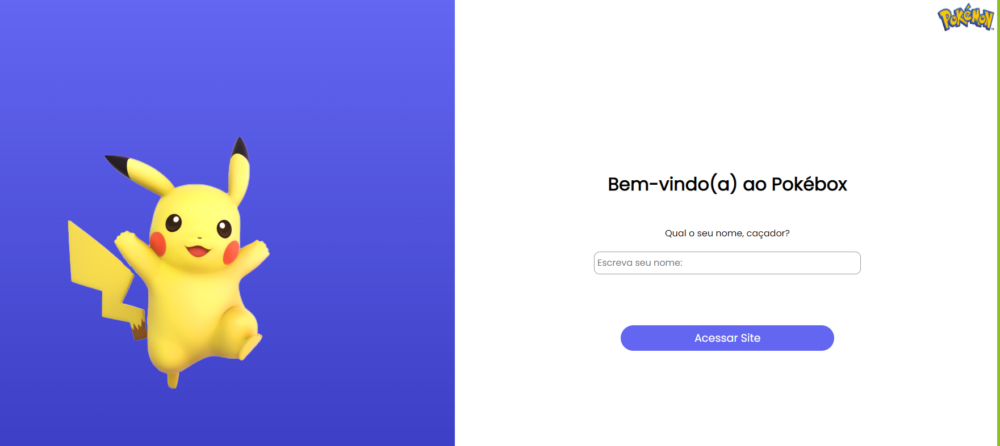
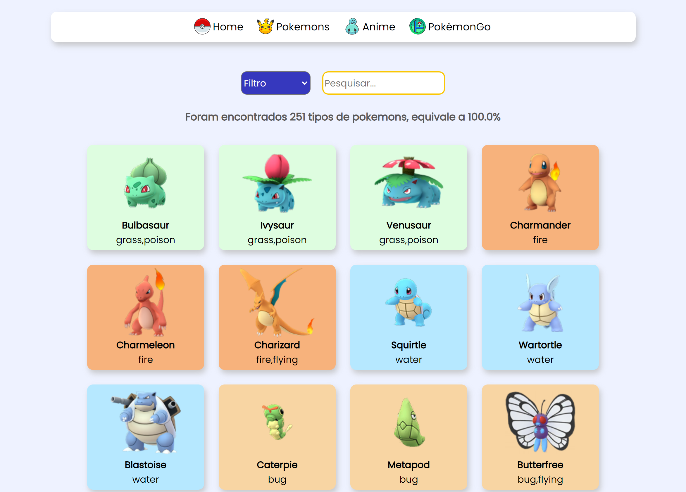
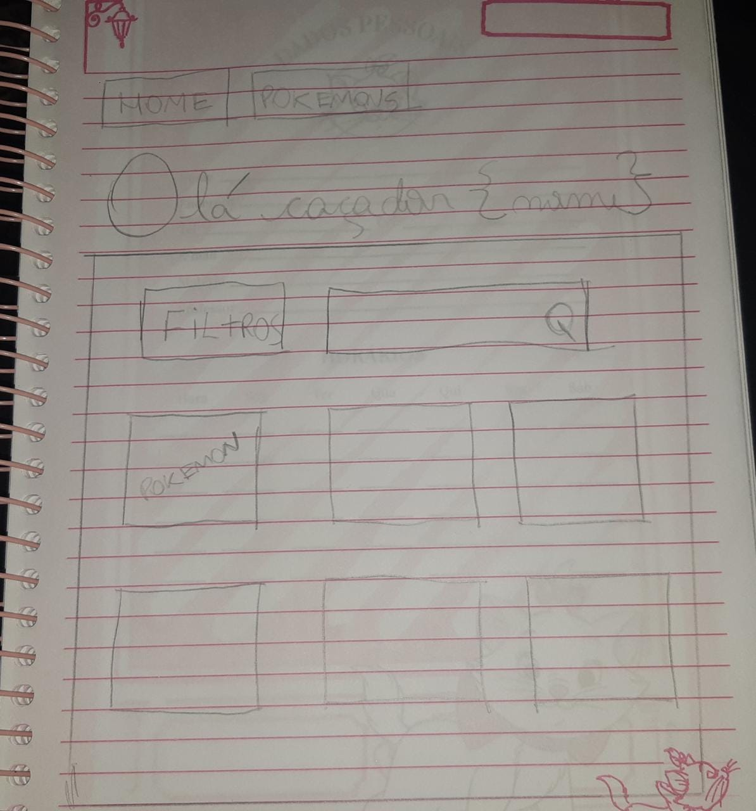

# Data Lovers - Pokémon
>SAP-010 Laboratoria

Desenvolvido por:
   
  Nicole Monalisa Tsingas - [Linkedin](https://www.linkedin.com/in/nicole-tsingas-2079b218b/) |
   [Github](https://github.com/nicoletsingas)
   
  Mislene Moura - [Linkedin](https://www.linkedin.com/in/mislene-silva-moura-1211531b4//) |
   [Github](https://github.com/MisleneSM)
   
***

## Índice

* [1. Prefácio](#1-prefácio)
* [2. Resumo do projeto](#2-resumo-do-projeto)
* [3. Histórias de usuário](#3-histórias-de-usuário)
* [4. Objetivos de aprendizagem](#4-objetivos-de-aprendizagem)
* [5. Tecnologias Utilizadas](#9-tecnologias-utilizadas)

***

## 1. Prefácio🤩

O Pokébox é um website pensado e criado tendo como público alvo os fãs de Pokémon anime e do jogo PokémonGO. 
PokémonGO é um jogo eletrônico free-to-play de realidade aumentada voltado para smartphones. Com o uso do GPS o jogo permite aos jogadores capturar, batalhar, e treinar criaturas virtuais chamadas Pokémon, que aparecem na tela do jogador usando realidade aumentada.

***

## 2. Resumo do projeto📝

Neste projeto foi desenvolvido um website na qual o usuário visualizará os 251 pokémons e poderá filtrá-los pelo nome e tipo(elemento), ordená-los em ordem alfabética (A-Z, Z-A) e será mostrado uma estatística de tipo de dados conforme sua busca. O Website consta com uma interface 100% responsiva (pode ser acessado pelo celular, tablet, notebook).

### Versão Final📎[Acesse aqui](https://nicoletsingas.github.io/SAP010-data-lovers/)

***

## 3. Histórias de usuário📝

 <strong>História de usuário 1:</strong> Como um(a) treinador(a) Pokémon, eu quero um site explicativo e que me entregue uma ótima experiência. Por exemplo: que meu nome apareça ao acessar este site.  

<strong>História de usuário 2:</strong> Como um(a) treinador(a) Pokémon, eu quero ter acesso a todos os pokémons e poder filtrá-los em ordem alfabética e pesquisar por um determinado tipo ou nome do pokémon.  

<strong>História de usuário 3:</strong> Como um(a) treinador(a) Pokémon, eu quero saber sobre a criação do Pokémon, quem foi o criador, história do anime e sobre o jogo PokemonGO.  

### Desenho de interface do usuário

#### Protótipo de baixa fidelidade

#### Protótipo de alta fidelidade

***

## 4. Objetivos de aprendizagem✅

<ul>
  <li>Uso de HTML semântico</li> 
  <li>Uso de seletores de CSS</li> 
  <li>Modelo de caixa (box model): borda, margem, preenchimento</li>  
  <li>Uso de flexbox e grid em CSS</li> 
  <li>Uso de seletores de DOM</li> 
  <li>Manipulação de eventos de DOM (listeners, propagação, delegação)</li> 
  <li>Arrays (arranjos)</li> 
  <li>Objetos (key, value)</li> 
  <li>Variáveis (declaração, atribuição, escopo)</li> 
  <li>Diferenciar entre tipos de dados primitivos e não primitivos</li> 
  <li>Uso de condicionais (if-else, switch, operador ternário, lógica booleana)</li> 
  <li>Funções (params, args, return)</li> 
  <li>Testes unitários (unit tests)</li> 
</ul>

***

## 5. Tecnologias Utilizadas✅ 

       
  

  
